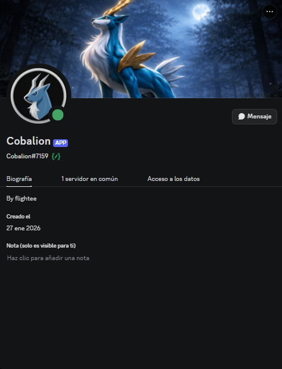

<h1 align="center">Cobalion</h1>

Pokémon GO Real-Time Coordinates Bot

  

### 🇪🇸 Español

¿Cansado de perder Pokémon perfectos?

Con **Cobalion** recibes **coordenadas en tiempo real**, filtradas exactamente según lo que necesitas, directamente en tu servidor de Discord.

---

### 🎯 ¿Qué obtienes?

* 📍 Coordenadas en tiempo real
* 💯 Filtro por IV (0% – 100%)
* 🎯 Búsqueda por estadísticas:

  * Ataque (0–15)
  * Defensa (0–15)
  * HP (0–15)
* 🔄 Actualización automática cada ~60 segundos
* 🗺️ Link directo a Google Maps
* ⚔️ Coordenadas de Raids
* 🧩 Configuración personalizada

---

### ⚡ Automatización total

* Envío automático de Pokémon **100 IV**
* Filtros personalizados
* Separación por canales
* Funcionamiento 24/7

---

### 📩 Contacto

💬 Discord: **flightee**

👉 Escríbeme para obtener acceso

---

---

### 🇺🇸 English

Tired of missing perfect Pokémon?

With **Cobalion**, you get **real-time coordinates**, fully filtered based on your preferences, directly in your Discord server.

---

### 🎯 Features

* 📍 Real-time coordinates
* 💯 IV filter (0% – 100%)
* 🎯 Custom stat filters:

  * Attack (0–15)
  * Defense (0–15)
  * HP (0–15)
* 🔄 Auto updates (~every 60 seconds)
* 🗺️ Direct Google Maps link
* ⚔️ Raid coordinates
* 🧩 Full customization

---

### ⚡ Full Automation

* Automatic **100 IV Pokémon** alerts
* Custom filters
* Multi-channel setup
* Runs 24/7

---

### 📩 Contact

💬 Discord: **flightee**

👉 Message me for access

---

🔥 **Stop missing perfect Pokémon. Get them in real time.**
